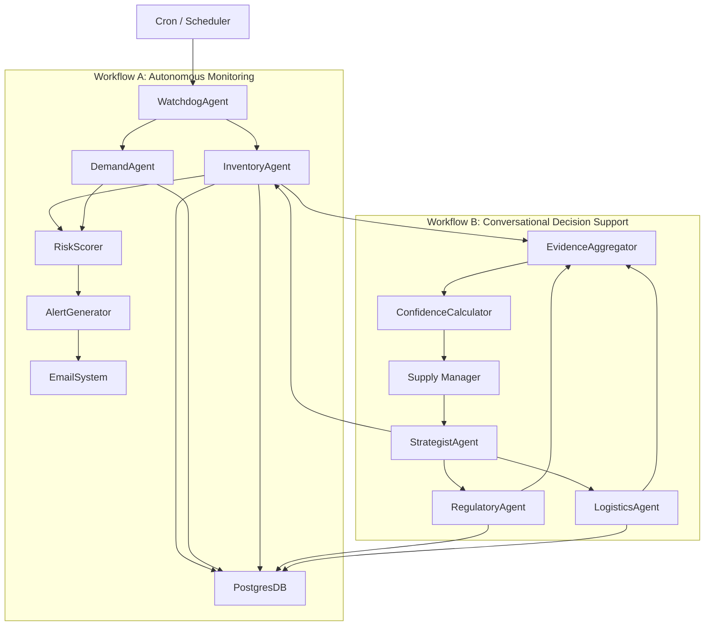
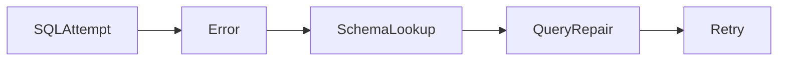

# Clinical Supply Chain Control Tower  
### Agentic AI Architecture Design

---

## Overview

Global Pharma Inc. manages clinical trials across 50+ countries with supply chain data fragmented across 40+ internal tables (SAP extracts, SharePoint lists, Excel trackers). Manual reconciliation introduces two systemic risks:

- **Stock-outs** → Patients unable to receive medication due to unexpected enrollment spikes  
- **Waste** → High-value drugs expiring due to missed reallocation or shelf-life extension opportunities  

This project proposes a **multi-agent AI Control Tower** that automates risk detection and assists supply managers in regulated, high-impact decisions.

The system is designed around **two distinct workflows**:

1. **Supply Watchdog** – Autonomous, scheduled risk monitoring  
2. **Scenario Strategist** – Conversational, evidence-backed decision support  

---

## Architectural Principles

- Agents do **not** directly access raw databases  
- Each agent owns a **single, well-defined domain**  
- All decisions are **explainable, auditable, and structured**  
- Autonomous workflows and conversational workflows are **architecturally isolated**  
- Confidence is derived from **evidence quality**, not LLM probability  

---

## High-Level Architecture



---

## Agent Responsibilities

### Supply Watchdog Agent (Coordinator)
- Orchestrates daily autonomous monitoring
- Applies business thresholds
- Produces structured alert payloads

---

### Inventory Agent
**Tables**
- Affiliate Warehouse Inventory  
- Allocated Materials  
- Available Inventory Report  
- Batch Master  

**Responsibilities**
- Expiry calculations
- Batch-level aggregation
- Inventory normalization

---

### Demand Agent
**Tables**
- Country Level Enrollment  
- Enrollment Rate Report  

**Responsibilities**
- Enrollment trend analysis
- Short-term demand projection (4–8 weeks)

---

### Risk Scoring Agent
- Converts raw findings into business-critical risk levels
- Applies deterministic policies (Critical / High / Medium)

---

### Scenario Strategist Agent
- Conversational router
- Decomposes user intent
- Delegates checks to domain agents

---

### Regulatory Agent
**Tables**
- RIM  
- Material Country Requirements  

**Responsibilities**
- Country-specific approval checks
- Shelf-life extension eligibility validation

---

### Logistics Agent
**Tables**
- IP Shipping Timelines  
- Distribution Order Report  

**Responsibilities**
- Execution feasibility
- Shipping lead-time validation

---

### Evidence Aggregator
- Collects structured outputs from all agents
- Enforces explicit citation of data sources

---

### Decision Confidence Calculator

**Purpose**
- Quantifies the strength of a decision based on evidence quality
- Ensures trust, governance, and safe human oversight

---

## Workflow A: Supply Watchdog (Autonomous Monitoring)

### Objectives
- Detect expiring allocated inventory (≤ 90 days)
- Predict shortfalls based on projected demand

### Output

```json
{
  "alert_type": "SHORTFALL_RISK",
  "trial_id": "TRIAL_ABC",
  "country": "DE",
  "risk_level": "CRITICAL",
  "weeks_remaining": 6.1,
  "recommended_action": "Initiate reallocation or resupply"
}
```

---

## Workflow B: Scenario Strategist (Conversational Decision Support)

### Example Query
> “Can we extend the expiry of Batch #123 for the German trial?”

### Decision Constraints
1. **Technical** – Prior re-evaluation status  
2. **Regulatory** – Country approval for extension  
3. **Logistical** – Time available to execute  

---

## Decision Confidence & Trust Model

Decisions are accompanied by a **deterministic confidence score**, derived from evidence quality — not model intuition.

### Scoring Dimensions

| Dimension | Weight |
|--------|--------|
| Constraint Coverage | 40% |
| Data Completeness | 30% |
| Data Freshness | 20% |
| Ambiguity Resolution | 10% |

### Confidence Interpretation

| Score | Meaning | System Behavior |
|-----|--------|----------------|
| ≥ 85 | High | Decision presented directly |
| 65–84 | Medium | Decision with caution notice |
| < 65 | Low | Human review required |

### Example Response

```json
{
  "decision": "NO",
  "confidence_score": 91.4,
  "decision_strength": "HIGH",
  "reasoning": [
    {
      "constraint": "Regulatory",
      "finding": "Shelf-life extension not approved in Germany",
      "source": "RIM.submission_status"
    }
  ]
}
```

---

## Schema Awareness Strategy

- Central schema registry
- On-demand schema retrieval
- No schema dumping into prompts

```python
get_table_schema(table_name: str) -> Dict
```

---

## Edge Case Handling

### Ambiguous Entity Names
- Fuzzy resolution with confidence scoring
- Auto-resolve if confidence ≥ 0.9
- Clarification requested otherwise

### Invalid SQL Self-Healing



---

## Dataset Usage & Validation

The prototype was validated against the provided clinical supply chain dataset by loading the relevant CSV files into a PostgreSQL database.

For demonstration purposes, only the tables required by the two workflows were ingested, including:

- **Allocated Materials** – batch-level expiry and allocation data  
- **Batch Master** – expiry dates and re-evaluation history  
- **Enrollment Rate Report** – recent enrollment trends used for demand projection  
- **Available Inventory Report** – country-level inventory availability  
- **RIM Submissions** – regulatory approval status by country  
- **IP Shipping Timelines** – execution and logistics lead times  

All alerts and scenario decisions shown in the prototype are generated by executing real SQL queries against these tables, not mocked data.

This ensures that:
- Risk detection is data-driven  
- Decisions are explainable and auditable  
- The system behavior reflects realistic clinical supply constraints  

In a production deployment, dataset ingestion would be automated via ETL pipelines; however, the decision logic and agent orchestration demonstrated here would remain unchanged.


---

## Technology Stack

| Layer | Technology |
|----|----|
| API | FastAPI (async) |
| Database | PostgreSQL |
| Orchestration | Agent Coordinator |
| LLM Access | OpenRouter |
| Scheduling | Cron / n8n |
| Alerts | Email / Slack |

---

## Summary

This architecture delivers:
- Autonomous monitoring without hallucination risk  
- Conversational decision support with regulatory explainability  
- Deterministic confidence scoring for trust and governance  

This is a **decision-support control tower**, not a chatbot.